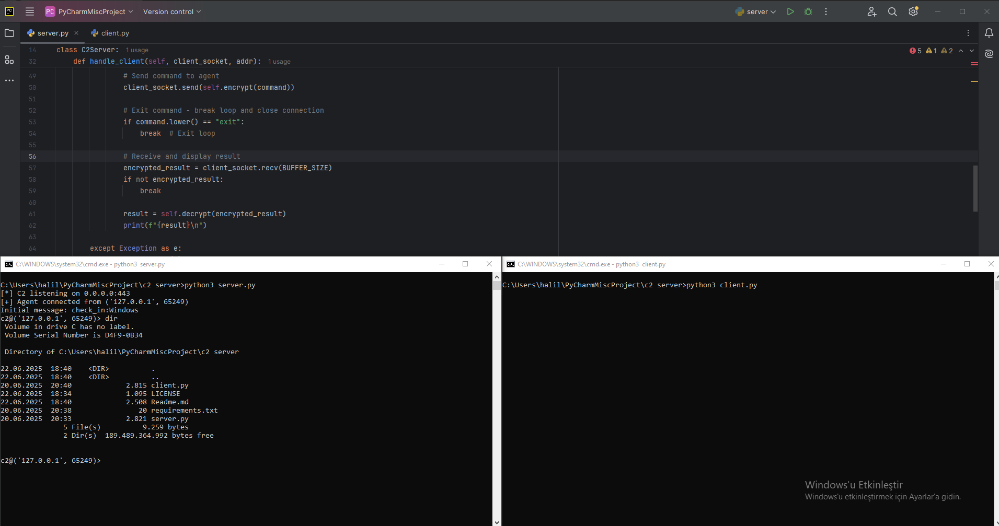

# Python C2 Server for Red Teaming



#### Project Overview

This repository contains a Python-based Command and Control (C2) framework designed for authorized red team operations and security research. The system enables secure, encrypted communication between a C2 server and one or more remote agents. The communication uses AES-CBC encryption, and the framework allows remote shell command execution and result retrieval in real time.


#### Features

- **AES-CBC Encrypted Communication:** All traffic between server and agent is encrypted with a 256-bit key.
- **Cross-Platform Agent:** The agent automatically detects and reports its operating system.
- **Interactive Server Console:** The operator can send commands and receive outputs interactively.
- **Multi-Agent Support:** The server can handle multiple agents concurrently using threading.
- **Automatic Reconnection:** The agent attempts to reconnect if the connection is lost.
- **Configurable Settings:** IP, port, and encryption key can be easily customized.


> **Note:** For security, always change the default key and passphrase before deployment.

#### Usage

##### Start the C2 Server

```bash
python server.py
[*] C2 listening on 0.0.0.0:443
```

##### Deploy the Agent

```bash
python client.py
```

##### Command and Control Example

When an agent connects, the server provides an interactive shell for command execution:
```
[+] Agent connected from ('192.168.1.10', 54321)
Initial message: check_in:Windows

c2@('192.168.1.10', 54321)> whoami
DESKTOP\user

c2@('192.168.1.10', 54321)> ipconfig
Ethernet adapter Local Area Connection:
   IPv4 Address. . . . . . . . . . . : 192.168.1.10

c2@('192.168.1.10', 54321)> exit
[-] Agent ('192.168.1.10', 54321) disconnected
```

If the agent loses connection, it will automatically attempt to reconnect every 60 seconds.


#### Roadmap

- [ ] Dynamic key exchange and session key support
- [ ] TLS/SSL encrypted connections
- [ ] Command allowlisting and output size management
- [ ] Traffic obfuscation (e.g., HTTPS, domain fronting)
- [ ] Agent auto-update capability


#### Legal Disclaimer

> **WARNING:** This software is intended for authorized penetration testing and educational purposes only. Unauthorized use is illegal. The user assumes all responsibility for misuse.

#### Contribution & License

Feel free to open issues or submit pull requests for improvements or bug fixes.  
License: [MIT](LICENSE)
